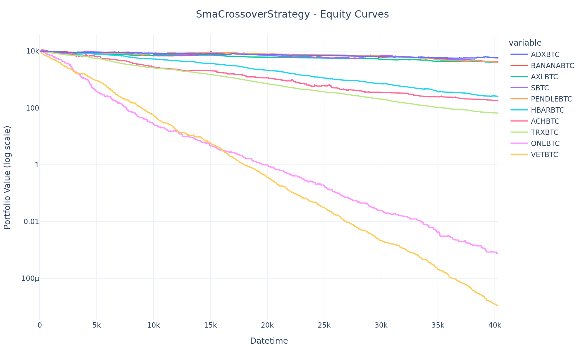

# Multi-Strategy Cryptocurrency Trading Backtesting App

## Overview
This project provides a comprehensive backtesting application for cryptocurrency trading strategies, leveraging 1-minute OHLCV data from Binance for around 100 BTC-*altcoin* pairs during February 2025. The goal is to assess the performance of different trading approaches in a single environment and compare them using key metrics such as Sharpe Ratio, total return, and drawdown.

## Project Structure
```
├── pyproject.toml           # Project configuration and dependencies
├── README.md                # Documentation
├── src/
│   └── btc_backtest/
│       ├── core/            # Core backtesting logic (backtester, data_loader, metrics)
│       │   ├── ...
│       ├── main.py          # Main script for running the backtest
│       └── strategies/      # Strategy implementations
│           ├── base.py
│           ├── rsi_bollinger.py
│           ├── sma_cross.py
│           └── volume_spike_breakout.py
└── tests/                   # Tests
```

## Prerequisites
- Python 3.12+
- All dependencies are listed in `requirements.txt`.

## Installation

1. Clone the repository:
   ```bash
   git clone https://github.com/Krak3nDev/btc_backtest.git
   cd btc_backtest
   ```
2. Create and activate a virtual environment:
   ```bash
   python -m venv venv
   source venv/bin/activate  # Unix/macOS
   # or Windows:
   venv\Scripts\activate
   ```
3. Install the project and dependencies:
   ```bash
   pip install -e .
   pip install -r requirements.txt
   ```

## Trading Strategies

### 1. SMA Crossover Strategy (Trend-Following)
A strategy based on the crossover of “fast” and “slow” moving averages. It performs well in trending markets but may produce numerous false signals during sideways (range-bound) conditions.

### 2. RSI Bollinger Strategy (Mean Reversion)
Combines the RSI indicator with Bollinger Bands to detect oversold conditions and potential price rebounds. It proved fairly effective for markets that exhibit frequent “swing” movements.

### 3. Volume Spike Breakout Strategy (Momentum)
Monitors sharp “spikes” in trading volume and breakouts of recent highs. It can be effective in volatile conditions but may suffer from false breakouts if additional filters are not used.

## Trading Strategy Performance Analysis

### General Observations
- **Data**: 1-minute candles (February 2025) across ~100 BTC-*altcoin* pairs.  
- **Metrics**: Sharpe Ratio, total return, maximum drawdown, etc.

### Strategy Effectiveness
- **SMA Crossover**  
  Shows mostly a declining balance trend due to high sensitivity to market noise.

- **RSI Bollinger**  
  Achieved positive Sharpe Ratios on many pairs and notable portfolio balance growth, particularly when bouncing off “oversold” levels.

- **Volume Spike Breakout**  
  Often produced moderate or negative results, likely due to a large number of false breakouts. In favorable conditions, however, it can generate substantial gains.

### Comparative Table & Ranking
| Strategy                   | Overall Trend       | Sharpe Ratio               |
|:--------------------------:|:-------------------:|:--------------------------:|
| **RSI Bollinger**         | Best                | Positive on many pairs     |
| **Volume Spike Breakout** | Average             | Often low/negative         |
| **SMA Crossover**         | Worst               | Mostly negative            |

---

## Visualizations

Below are some additional example outputs (actual files in .png / .html):

<details>
  <summary>Heatmap - Total Return Example</summary>
  
</details>

**Analysis**  
In this heatmap, each cell represents the **total return** for a given strategy (rows) applied to a specific BTC-*altcoin* pair (columns). The color scale ranges from lower values in purple to higher values in yellow/green. Notable observations:

- **SmaCrossoverStrategy**: Mostly deep purple across the entire row, suggesting near-zero or very low total returns in most pairs. A few isolated brighter cells appear where returns were higher.  
- **RsiBollingerStrategy**: Visible as a narrow yellow band on certain pairs, indicating the strategy captured substantial returns there (over 1M, as shown in the color bar).  
- **VolumeSpikeBreakoutStrategy**: Dominantly purple, reflecting either zero or poor total returns on most instruments. However, it still shows slight variations in hue, indicating occasional moderate success.

---

<details>
  <summary>Heatmap - Sharpe Ratio Example</summary>
  
</details>

**Analysis**  
This heatmap visualizes the **Sharpe Ratio** for each strategy–pair combination. Warmer shades (yellow/green) indicate a higher Sharpe Ratio (i.e., better risk-adjusted returns), while cooler shades (blue/purple) point to low or negative Sharpe Ratios. Notable insights:

- **SmaCrossoverStrategy**: Shows a mix of greens and occasional deeper blues/purples, implying that while some pairs yielded near-neutral (greenish) risk-adjusted returns, many are quite negative.  
- **RsiBollingerStrategy**: Contains several yellow or brighter green cells, revealing positively skewed Sharpe Ratios. This suggests better balancing of risk and reward on certain pairs (likely those experiencing timely “oversold” bounces).  
- **VolumeSpikeBreakoutStrategy**: Largely skews toward the purple/blue side, indicating negative Sharpe Ratios for most pairs. Still, there are a few lighter squares, hinting at sporadic successful breakouts.

A high Sharpe Ratio generally means the strategy achieved returns above the risk-free rate per unit of volatility. Conversely, very negative values can signify either large drawdowns or inconsistent performance relative to volatility.

---

### Equity Curves

<details>
  <summary>RSI Bollinger Strategy - Equity Curves</summary>
  
</details>

**Analysis**  
Each line shows the **portfolio value** (log scale) over time for different BTC-*altcoin* pairs under the RSI Bollinger Strategy. Notice how certain pairs (e.g., ONEBTC in blue, VETBTC in red) exhibit exponential growth, likely because the RSI-based entries coincided with significant price rebounds. Other pairs remain relatively flat or show minimal gains.

---

<details>
  <summary>SMA Crossover Strategy - Equity Curves</summary>
  
</details>

**Analysis**  
Most lines trend downward, indicating that the SMA Crossover Strategy struggled in the given market conditions. High volatility and frequent whipsaws may have triggered multiple losing trades. A few lines remain close to the initial capital (10k), suggesting some pairs were less impacted by false signals.

---

<details>
  <summary>Volume Spike Breakout Strategy - Equity Curves</summary>
  
</details>

**Analysis**  
This strategy aims to catch momentum driven by heavy trading volume. However, in many pairs the equity curve declines steadily, implying that volume spikes did not often translate into sustained breakouts. A few lines near the top remain relatively flat, indicating minimal overall growth or loss, while some plummet dramatically, reflecting whipsawed entries after false breakouts.

---

## Usage
```bash
python src/btc_backtest/main.py
```
(Once executed, results will appear in `results/`.)

---

```